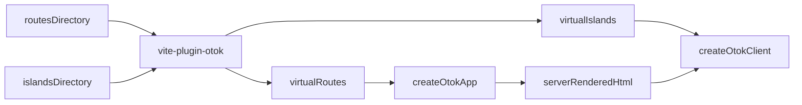

# Otok

Otok is a small Hono + Preact Islands framework for server-rendered apps that only ship browser JavaScript where a page actually needs interactivity.

## Quick Start

```bash
pnpm create otok my-app
cd my-app
pnpm install
pnpm dev
```

An Otok app has three main entry points:

```text
src/server.ts          Hono server entry
src/client.ts          Island hydration entry
src/app/routes/        File-based pages, layouts, and special routes
src/app/islands/       Interactive Preact components
```

## How Rendering Works

1. `@otok/vite-plugin` scans `src/app/routes` and generates `virtual:otok-routes`.
2. The server uses `createOtokHandler()` or `createOtokApp()` from `otok/server`.
3. Pages render on the server with Preact.
4. `<Island>` marks interactive regions in the HTML.
5. `createOtokClient()` hydrates only those island roots.
6. If a page renders no islands, Otok omits the client module script.



## Routing

Routes are files in `src/app/routes`.

```text
routes/index.tsx              /
routes/about.tsx              /about
routes/users/[id].tsx         /users/:id
routes/docs/[...slug].tsx     /docs/:slug*
routes/[[lang]]/about.tsx     /about and /:lang/about
routes/(marketing)/about.tsx  /about
```

Special files:

```text
routes/_layout.tsx       Shared layout for the directory
routes/_not-found.tsx    Convention-based 404 page
routes/_error.tsx        Convention-based error page
```

Files in `routes` that start with `$` are treated as co-located islands and are not matched as pages.

## Islands

Islands are Preact components rendered on the server and hydrated later in the browser.

```tsx
import { Island } from "otok/client";
import Counter from "../islands/counter";

export default function Page() {
  return <Island component={Counter} props={{ init: 5 }} strategy="visible" />;
}
```

Otok assigns island IDs from filenames at build time. This avoids production mismatches caused by minified or anonymous component names.

Hydration strategies:

```text
load      Hydrate immediately
idle      Hydrate during idle time
visible   Hydrate when the island enters the viewport
media     Hydrate when a media query matches
```

Island props must be JSON-serializable. Small payloads are stored in a base64url HTML attribute. Larger payloads are emitted as adjacent `application/json` script blocks to avoid large attributes.

## Server Entry

```ts
import { serve } from "@hono/node-server";
import { createOtokApp } from "otok/server";
import { errorRoute, notFoundRoute, routes } from "virtual:otok-routes";

const app = createOtokApp({
  routes,
  notFoundRoute,
  errorRoute,
  clientEntry: "src/client.ts",
  devClientEntry: "/src/client.ts",
  staticDir: "./dist/client",
  health: { ok: true, framework: "otok" },
});

serve({ fetch: app.fetch, port: 3000 });
```

## Build

The default template uses separate Vite builds for the client and server:

```bash
pnpm build:client
pnpm build:server
pnpm start
```

The client build writes a Vite manifest. The server build reads that manifest in production so Otok can link the hashed client entry and CSS assets.

## Learn More

See `docs/conventions.md` for the complete route, layout, island, head, and error-handling conventions.
