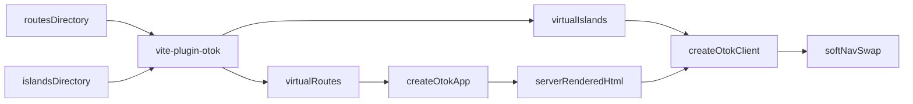

# Otok

Otok is a small Hono + Preact Islands framework for server-rendered apps that only ship browser JavaScript where a page actually needs interactivity.

## Quick Start

```bash
pnpm create otok my-app              # minimal template (default)
pnpm create otok my-app --template full   # dashboard demo with kamod-ui
cd my-app
pnpm install
pnpm dev
```

An Otok app has three main entry points:

```text
src/server.ts          Hono server entry
src/client.ts          Island hydration entry
src/app/routes/        File-based pages, layouts, and special routes
src/app/islands/       Interactive Preact components
```

## How Rendering Works

1. `@otok/vite-plugin` scans `src/app/routes` and generates `virtual:otok-routes`.
2. The server uses `createOtokHandler()` or `createOtokApp()` from `otok/server`.
3. Pages render on the server with Preact.
4. `<Island>` marks interactive regions in the HTML.
5. `createOtokClient()` hydrates only those island roots.
6. With `softNav: true`, internal links fetch the next page and swap only marked regions so layout chrome can stay mounted.
7. If a page renders no islands, Otok omits the client module script.



## Soft Navigation

Enable partial page updates so persistent layout chrome (sidebars, shells) does not reload on every click:

```ts
createOtokClient({ registry: islandModules, softNav: true });
```

Otok wraps each page in `data-otok-page`. Mark layout regions that change with the route using `data-otok-swap`:

```tsx
<nav data-otok-swap="sidebar-nav">...</nav>
<header data-otok-swap="topbar">...</header>
<main>{children}</main>
```

On internal link clicks Otok:

1. prefetches HTML on link hover (when enabled)
2. fetches the destination HTML
3. replaces `[data-otok-page]`
4. patches every matching `[data-otok-swap]`
5. syncs managed head metadata (`data-otok-head`)
6. hydrates new islands
7. updates the URL with `history.pushState`

Use `data-otok-no-nav` to opt a link out (downloads, external flows). If the fetched HTML has no page region, Otok falls back to a full navigation.

## Route Chrome

Export `chrome` from a route module to pass layout shell metadata without a central route switch:

```tsx
export const chrome = ({ data, params }) => ({
  title: "Dashboard",
  description: "Overview",
  toolbar: <Island component={Toolbar} props={{}} />,
});

export default function Page({ data }) {
  return <p>...</p>;
}
```

Layouts receive `chrome` on `OtokLayoutProps` alongside `data`, `params`, and `route`.

## Routing

Routes are files in `src/app/routes`.

```text
routes/index.tsx              /
routes/about.tsx              /about
routes/users/[id].tsx         /users/:id
routes/docs/[...slug].tsx     /docs/:slug*
routes/[[lang]]/about.tsx     /about and /:lang/about
routes/(marketing)/about.tsx  /about
```

Special files:

```text
routes/_layout.tsx       Shared layout for the directory
routes/_not-found.tsx    Convention-based 404 page
routes/_error.tsx        Convention-based error page
```

Files in `routes` that start with `$` are treated as co-located islands and are not matched as pages.

The Vite plugin also exports `routePaths` and `OtokRoutePath` from `virtual:otok-routes` for typed route paths.

## Islands

Islands are Preact components rendered on the server and hydrated later in the browser.

```tsx
import { Island } from "otok/client";
import Counter from "../islands/counter";

export default function Page() {
  return <Island component={Counter} props={{ init: 5 }} strategy="visible" />;
}
```

Otok assigns island IDs from filenames at build time. This avoids production mismatches caused by minified or anonymous component names. The plugin warns when two island files resolve to the same id.

Hydration strategies:

```text
load         Hydrate immediately
idle         Hydrate during idle time
visible      Hydrate when the island enters the viewport
media        Hydrate when a media query matches
client-only  Skip SSR markup; hydrate an empty shell on the client
```

Island props must be JSON-serializable. Small payloads are stored in a base64url HTML attribute. Larger payloads are emitted as adjacent `application/json` script blocks to avoid large attributes.

## Server Entry

```ts
import { serve } from "@hono/node-server";
import { createOtokApp, readOtokManifest } from "otok/server";
import { errorRoute, notFoundRoute, routes } from "virtual:otok-routes";

const app = createOtokApp({
  routes,
  notFoundRoute,
  errorRoute,
  manifest: readOtokManifest(import.meta.url),
  clientEntry: "src/client.ts",
  devClientEntry: "/src/client.ts",
  staticDir: "./dist/client",
  health: { ok: true, framework: "otok" },
  theme: true,
});

serve({ fetch: app.fetch, port: 3000 });
```

Pass `theme: true` to include the built-in dark-mode bootstrap script. Omit it for apps that manage theme themselves.

## Full-Stack Apps (API + SSR)

Use `createOtokHandler()` when the app needs custom API routes, auth middleware, or uploads:

```ts
import { Hono } from "hono";
import { createOtokHandler, readOtokManifest } from "otok/server";
import { errorRoute, notFoundRoute, routes } from "virtual:otok-routes";

const app = new Hono();

app.get("/api/health", (c) => c.json({ ok: true }));
app.route("/api/documents", createDocumentRoutes());

const ssr = createOtokHandler({
  routes,
  notFoundRoute,
  errorRoute,
  manifest: readOtokManifest(import.meta.url),
  clientEntry: "src/client.ts",
  devClientEntry: "/src/client.ts",
});

app.get("*", ssr);
```

Or register handlers before SSR through `createOtokApp({ configure })`:

```ts
createOtokApp({
  routes,
  configure: (app) => {
    app.route("/api/auth", authRoutes);
  },
});
```

Soft navigation automatically skips `/api/` links.

## Build

The default template uses separate Vite builds for the client and server:

```bash
pnpm build:client
pnpm build:server
pnpm start
```

The client build writes a Vite manifest. Use `readOtokManifest(import.meta.url)` in production so Otok can link the hashed client entry and CSS assets.

## Learn More

See `docs/conventions.md` for the complete route, layout, island, head, security, and error-handling conventions.
