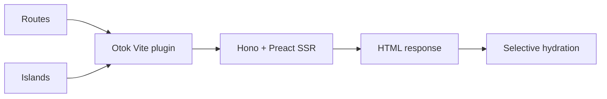

# Otok

**A server-first full-stack framework built on Hono, Preact, and Vite.**

Build fast, progressively enhanced web apps with server-side rendering, file-based routing, typed routes, route actions, middleware, and opt-in islands. Pages ship browser JavaScript only where interactivity is needed.


[Documentation](https://kamod-ch.github.io/otok/) · [Quick start](#quick-start) · [Examples](./examples) · [Roadmap](./apps/docs/content/project/roadmap.md) · [Discussions](https://github.com/kamod-ch/otok/discussions)

> [!IMPORTANT]
> Otok is under active development and has not reached 1.0 yet. Review the [release-candidate status](./docs/1.0/release-candidate.md) before using it in production.


## Why Otok?


| Capability                  | What it gives you                                                                          |
| --------------------------- | ------------------------------------------------------------------------------------------ |
| Server-first rendering      | HTML on the first response, with client JavaScript only for interactive islands            |
| File-based routing          | Pages, nested layouts, middleware, error boundaries, and typed URL generation              |
| Progressive enhancement     | Native forms and links work without JavaScript; soft navigation enhances them when enabled |
| Full-stack Hono foundation  | Add APIs, authentication, uploads, and Hono middleware beside SSR routes                   |
| Preact islands              | Hydrate components on load, idle, visibility, media query, or client-only                  |
| Deployable architecture     | Node.js reference deployment plus Edge-safe and Cloudflare Workers foundations             |
| Production-oriented tooling | Testing helpers, health checks, graceful shutdown, package checks, and reproducible builds |


Otok keeps its core focused: routing, rendering, islands, actions, middleware, and deployment primitives. UI libraries, databases, authentication, validation, and CSS remain explicit application choices.

## Quick Start

```bash
pnpm create otok@latest my-app
cd my-app
pnpm install
pnpm dev
```

Use the full dashboard starter with Kamod UI:

```bash
pnpm create otok@latest my-app --template full
```

An Otok app has four main areas:

```text
src/server.ts          Hono server entry
src/client.ts          Island hydration entry
src/app/routes/        File-based pages, layouts, and special routes
src/app/islands/       Interactive Preact components
```


## How It Works

1. The Vite plugin scans `src/app/routes` and generates typed route definitions.
2. Hono handles requests, middleware, loaders, actions, and API endpoints.
3. Preact renders pages to HTML on the server.
4. `<Island>` marks only the interactive parts of a page.
5. The client hydrates those islands using the selected loading strategy.
6. Optional soft navigation swaps page regions without remounting persistent layout chrome.
7. Pages without islands omit the client module entirely.


```mermaid
flowchart LR
  Routes["Routes"] --> Vite["Otok Vite plugin"]
  Islands["Islands"] --> Vite
  Vite --> Server["Hono + Preact SSR"]
  Server --> HTML["HTML response"]
  HTML --> Hydration["Selective hydration"]
```


## Routing

Routes are files in `src/app/routes`:

```text
routes/index.tsx              /
routes/about.tsx              /about
routes/users/[id].tsx         /users/:id
routes/docs/[...slug].tsx     /docs/:slug*
routes/[[lang]]/about.tsx     /about and /:lang/about
routes/(marketing)/about.tsx  /about
```

Special files colocate framework behavior with the routes they affect:

```text
_layout.tsx       Shared layout
_middleware.ts    Route middleware
_not-found.tsx    Convention-based 404 page
_error.tsx        Convention-based error page
```

The generated `virtual:otok-routes` module also provides a typed URL builder:

```ts
import { route } from "virtual:otok-routes";

route("/users/[id]", { params: { id: "alice" } });
route("/docs/[...slug]", { params: { slug: ["routing", "catch-all"] } });
```


## Loaders, Actions, and Forms

Route modules can load data and handle mutations on the server. Native HTML forms work without JavaScript; optional progressive enhancement uses the same soft-navigation runtime.

```tsx
import { fail, redirect, type OtokActionContext } from "@kamod-ch/otok/server";

export async function action({ formData }: OtokActionContext) {
  const name = String(formData?.get("name") ?? "").trim();

  if (!name) {
    fail(400, {
      message: "Validation failed",
      fieldErrors: { name: ["Name is required"] },
    });
  }

  await saveProject(name);
  redirect("/projects", 303);
}

export default function ProjectForm() {
  return (
    <form method="post">
      <input name="name" />
      <button>Save</button>
    </form>
  );
}
```

Otok also includes response helpers for JSON, redirects, validation failures, not-found responses, and typed route data.

## Islands

Islands are Preact components rendered on the server and hydrated later in the browser:

```tsx
import { Island } from "@kamod-ch/otok/client";
import Counter from "../islands/counter";

export default function Page() {
  return <Island component={Counter} props={{ initial: 5 }} strategy="visible" />;
}
```

Available hydration strategies:


| Strategy      | Behavior                                       |
| ------------- | ---------------------------------------------- |
| `load`        | Hydrate immediately                            |
| `idle`        | Hydrate during browser idle time               |
| `visible`     | Hydrate when the island enters the viewport    |
| `media`       | Hydrate when a media query matches             |
| `client-only` | Skip SSR markup and render only in the browser |


## Soft Navigation

Keep persistent shells mounted while replacing the current page and other named regions:

```ts
createOtokClient({
  registry: islandModules,
  softNav: { forms: true },
});
```

```tsx
<nav data-otok-swap="sidebar-nav">...</nav>
<header data-otok-swap="topbar">...</header>
<main>{children}</main>
```

Otok synchronizes managed head metadata, swaps matching regions, hydrates new islands, restores navigation state, and falls back to a full navigation when enhancement is not possible.

## Full-Stack Hono Apps

Use `createOtokHandler()` when your application also needs API routes, authentication middleware, or uploads:

```ts
import { Hono } from "hono";
import { createOtokHandler } from "@kamod-ch/otok/server";
import { routes } from "virtual:otok-routes";

const app = new Hono();

app.get("/api/health", (c) => c.json({ ok: true }));
app.get("*", createOtokHandler({ routes }));
```


## Build and Deploy

The default template creates separate Vite builds for browser and server code:

```bash
pnpm build:client
pnpm build:server
pnpm start
```

Node.js is the reference runtime. The repository also contains Cloudflare Workers smoke tests and Edge-safe runtime foundations. See [the Node deployment guide](./docs/deployment/node.md) for Docker, reverse-proxy, health-check, static-asset caching, and graceful-shutdown guidance.

## Testing

Use `@kamod-ch/otok-test` for server-side route tests without a browser or Vite development server:

```ts
import { createTestApp, renderRoute } from "@kamod-ch/otok-test";

const app = createTestApp({
  routes: [
    {
      path: "/users/:id",
      component: ({ params }) => <p>User {params.id}</p>,
    },
  ],
});

const { response, html } = await renderRoute(app, "/users/123");
```

Use Playwright for hydration, progressive enhancement, and browser behavior.

## Project Status

Otok is currently pre-1.0. The stabilization bundle is documented as a verifiable release candidate, not an automatic npm release:

- [Release-candidate assessment](./docs/1.0/release-candidate.md)
- [Release checklist](./docs/1.0/release-checklist.md)
- [Stabilization evidence](./docs/stabilization/status.md)
- [Changelog](./CHANGELOG.md)


## Resources

- [Documentation site](https://kamod-ch.github.io/otok/)
- [Framework conventions](./docs/conventions.md)
- [Examples](./examples)
- [Contributing guide](./CONTRIBUTING.md)
- [Security policy](./SECURITY.md)
- [GitHub Discussions](https://github.com/kamod-ch/otok/discussions)


## Contributing

Contributions are welcome. Read [CONTRIBUTING.md](./CONTRIBUTING.md), run the project checks locally, and include a changeset for user-visible package changes.

## License

Otok is available under the [MIT License](./LICENSE).