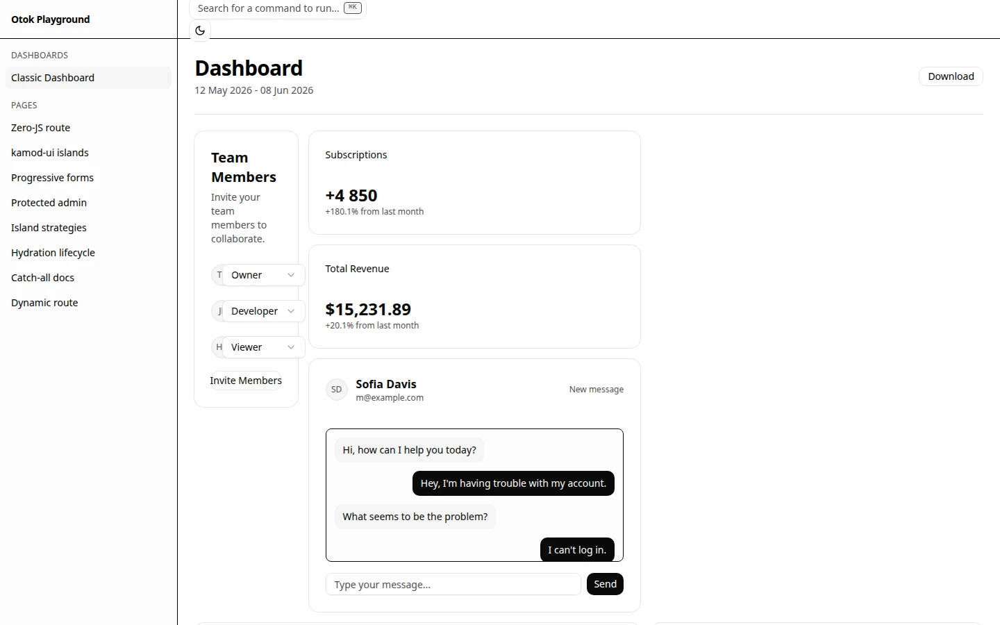
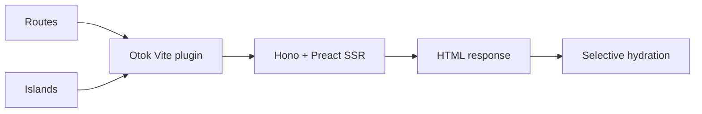

<div align="center">

<picture>
  <source media="(prefers-color-scheme: dark)" srcset="./assets/logo-wordmark-dark.svg" />
  <source media="(prefers-color-scheme: light)" srcset="./assets/logo-wordmark-light.svg" />
  
</picture>

**A server-first full-stack framework built on Hono, Preact, and Vite.**

SSR, file-based routing, and client JavaScript only on interactive islands.

[](https://github.com/kamod-ch/otok/actions/workflows/ci.yml)
[](https://www.npmjs.com/package/@kamod-ch/otok)


[Documentation](https://kamod-ch.github.io/otok/) · [Quick start](#quick-start) · [Examples](./examples) · [Roadmap](./apps/docs/content/project/roadmap.md) · [Discussions](https://github.com/kamod-ch/otok/discussions)

</div>

> [!IMPORTANT]
> Otok is currently pre-1.0. The stabilization bundle is documented as a [verifiable release candidate](./docs/1.0/release-candidate.md), not stable 1.0 on npm.

[](./apps/playground)

## Quick Start

```bash
pnpm create otok@latest my-app
cd my-app
pnpm dev
```

Installation runs during scaffold. For the dashboard starter with Kamod UI:

```bash
pnpm create otok@latest my-app --variant dashboard
```

Starter variants ([full CLI reference](./packages/create-otok/docs/cli.md)):

| Variant     | Description                                   |
| ----------- | --------------------------------------------- |
| `minimal`   | Counter demo, no UI library (default)         |
| `content`   | Blog / marketing content site                 |
| `kamod`     | Kamod UI + Tailwind                           |
| `dashboard` | Admin dashboard components                    |
| `saas`      | Auth, i18n, Kysely, validation, security, SEO |
| `crm`       | CRM demo with mutations                       |
| `api`       | Hono JSON API + minimal docs UI               |

An Otok app has four main areas:

```text
src/server.ts          Hono server entry
src/client.ts          Island hydration entry
src/app/routes/        File-based pages, layouts, and special routes
src/app/islands/       Interactive Preact components
```

## Why Otok?

| Differentiator          | What it gives you                                                                      |
| ----------------------- | -------------------------------------------------------------------------------------- |
| Server-first rendering  | HTML on the first response; client JavaScript only for interactive islands             |
| Progressive enhancement | Native forms and links work without JavaScript; optional soft navigation enhances them |
| Hono + typed routing    | File-based routes, middleware, and generated URL builders on a composable Hono app     |
| Deployable architecture | Node.js reference deployment plus Edge-safe and Cloudflare Workers foundations         |

Otok keeps its core focused: routing, rendering, islands, actions, middleware, and deployment primitives. UI libraries, databases, authentication, validation, and CSS remain explicit application choices.

## How It Works

The Vite plugin scans routes and islands; Hono serves requests; Preact renders HTML. Islands hydrate selectively; soft navigation can swap page regions without remounting layout chrome.


```mermaid
flowchart LR
  Routes["Routes"] --> Vite["Otok Vite plugin"]
  Islands["Islands"] --> Vite
  Vite --> Server["Hono + Preact SSR"]
  Server --> HTML["HTML response"]
  HTML --> Hydration["Selective hydration"]
```

## Routing

File-based routes under `src/app/routes` with colocated layouts and middleware. Typed URLs from `virtual:otok-routes`:

```ts
import { route } from "virtual:otok-routes";

route("/users/[id]", { params: { id: "alice" } });
```

See [routing](./apps/docs/content/core-concepts/routing.md) for catch-all routes, optional segments, and route groups.

## Loaders, actions, and forms

Route modules load data and handle mutations on the server. Native HTML forms work without JavaScript:

```tsx
import { fail, redirect, type OtokActionContext } from "@kamod-ch/otok/server";

export async function action({ formData }: OtokActionContext) {
  const name = String(formData?.get("name") ?? "").trim();
  if (!name) fail(400, { fieldErrors: { name: ["Name is required"] } });
  await saveProject(name);
  redirect("/projects", 303);
}

export default function ProjectForm() {
  return (
    <form method="post">
      <input name="name" />
      <button>Save</button>
    </form>
  );
}
```

Details: [loaders, actions, and forms](./apps/docs/content/core-concepts/loaders-actions-forms.md).

## Islands and soft navigation

Islands are Preact components rendered on the server and hydrated in the browser:

```tsx
import { Island } from "@kamod-ch/otok/client";
import Counter from "../islands/counter";

export default function Page() {
  return <Island component={Counter} props={{ initial: 5 }} strategy="visible" />;
}
```

Hydration strategies: `load`, `idle`, `visible`, `media`, and `client-only`.

Soft navigation swaps named regions while keeping shells mounted:

```ts
createOtokClient({ registry: islandModules, softNav: { forms: true } });
```

```tsx
<nav data-otok-swap="sidebar-nav">...</nav>
<main>{children}</main>
```

More: [islands and soft navigation](./apps/docs/content/core-concepts/islands-soft-navigation.md) and [server rendering](./apps/docs/content/core-concepts/server-rendering.md).

## Full-stack Hono apps

Compose API routes, auth middleware, and uploads beside SSR routes:

```ts
import { Hono } from "hono";
import { createOtokHandler } from "@kamod-ch/otok/server";
import { routes } from "virtual:otok-routes";

const app = new Hono();
app.get("/api/health", (c) => c.json({ ok: true }));
app.get("*", createOtokHandler({ routes }));
```

## Build, deploy, and testing

Default templates build separate client and server bundles (`pnpm build:client`, `pnpm build:server`, `pnpm start`). Node.js is the reference runtime; the repository includes Cloudflare Workers smoke tests and Edge-safe foundations. See the [deployment guide](./apps/docs/content/guides/deployment.md).

Use `@kamod-ch/otok-test` for server-side route tests without a browser:

```ts
import { createTestApp, renderRoute } from "@kamod-ch/otok-test";

const app = createTestApp({
  routes: [{ path: "/users/:id", component: ({ params }) => <p>User {params.id}</p> }],
});
const { response, html } = await renderRoute(app, "/users/123");
```

Use Playwright for hydration and browser behavior. See [testing](./apps/docs/content/guides/testing.md).

## Ecosystem

Opt-in packages cover adapters/deployment, auth and data, content/i18n/SEO, queues and workflows, testing and observability, and business kits. See [extensions](./apps/docs/content/guides/extensions.md), [business kits](./docs/business-kits.md), and [examples](./examples).

## Project Status

Otok is currently pre-1.0. The stabilization bundle is documented as a verifiable release candidate, not an automatic npm release:

- [Release-candidate assessment](./docs/1.0/release-candidate.md)
- [Release checklist](./docs/1.0/release-checklist.md)
- [Stabilization evidence](./docs/stabilization/status.md)
- [Changelog](./CHANGELOG.md)

## Resources

- [Documentation site](https://kamod-ch.github.io/otok/)
- [Framework conventions](./docs/conventions.md)
- [Examples](./examples)
- [Contributing guide](./CONTRIBUTING.md)
- [Security policy](./SECURITY.md)
- [GitHub Discussions](https://github.com/kamod-ch/otok/discussions)

## Contributing

Contributions are welcome. Read [CONTRIBUTING.md](./CONTRIBUTING.md), run the project checks locally, and include a changeset for user-visible package changes.

## License

Otok is available under the [MIT License](./LICENSE).
