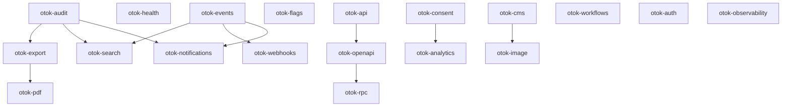

# Otok Ecosystem Extensions — Architecture & Priority

This document defines the rollout plan for 16 independent Otok extensions. Each package follows the established `@kamod-ch/otok-*` pattern: small public contract, provider architecture, plugin integration, runtime capability checks, secure defaults, no client secrets, production + test providers, tests, docs, and a realistic example.

## Design principles (all packages)

| Principle | Implementation |
|-----------|----------------|
| Public contract | `define*` helpers + typed service interface + `./plugin` subpath |
| Providers | `memory` (dev/test) + at least one production backend |
| Plugin API | `definePlugin` → `configureApp` → registry singleton |
| Request context | `AsyncLocalStorage` bridge (actor, tenant, requestId) |
| Capability check | `tryGet*Runtime()` / `has*Capability()` — fail gracefully in edge |
| Secure defaults | Redaction, no secrets in exports, server-only plugin routes |
| Tests | Unit + integration + `*.test-d.ts` type tests |
| Examples | `examples/<name>/` or bundled `./crm` preset |

## Dependency graph

## Priority tiers

### Tier 1 — Platform foundations (implement first)

| # | Package | Rationale | Depends on |
|---|---------|-----------|------------|
| 1 | **otok-audit** | Compliance, traceability; feeds export/search | events (optional) |
| 2 | **otok-export** | Data egress; uses audit for export logging | audit |
| 3 | **otok-search** | Discovery; indexes via events | events |
| 4 | **otok-webhooks** | Outbound integrations; shares retry/idempotency patterns with events | events |
| 5 | **otok-health** | Ops/K8s; minimal deps, high deployment value | — |
| 6 | **otok-notifications** | User-facing comms; uses events + audit | events, audit |
| 7 | **otok-api** + **otok-openapi** | API consistency layer for all HTTP surfaces | validation |

### Tier 2 — Product features

| # | Package | Rationale |
|---|---------|-----------|
| 8 | **otok-flags** | Feature toggles; needed before staged rollouts |
| 9 | **otok-analytics** | Product metrics; consent-gated |
| 10 | **otok-consent** | GDPR/legal prerequisite for analytics |
| 11 | **otok-cms** | Structured content beyond otok-content collections |
| 12 | **otok-image** | Media pipeline for CMS |
| 13 | **otok-pdf** | Document generation; uses export patterns |
| 14 | **otok-rpc** | Typed internal APIs atop openapi client |

## Per-package scope summary

### otok-audit ✅ (Tier 1 #1)
Actor, action, resource, timestamp, changes. Multi-tenant. Append-only immutable log. Redaction. Search + export (JSON/CSV).

### otok-export (Tier 1 #2)
CSV, JSON, XLSX. Streaming. Large datasets. Locale/timezone. Background export via workflows.

### otok-search (Tier 1 #3)
PostgreSQL FTS, Meilisearch, Typesense providers. Event-driven indexing. Filters, sort, facets. Reindex command.

### otok-webhooks (Tier 1 #4)
HMAC-signed payloads. Secret rotation. Retry/backoff. Idempotency keys. Delivery log. Manual replay.

### otok-health (Tier 1 #5)
`/health/live`, `/health/ready`. Dependency checks (DB, redis, external APIs). K8s probe-compatible JSON.

### otok-notifications (Tier 1 #6)
In-app inbox. Email via otok-mail. Push provider contract. Preferences. Read status. Templates.

### otok-api + otok-openapi (Tier 1 #7)
REST conventions. Typed req/res (Zod). Standard error envelope. Cursor pagination. OpenAPI 3.1 spec generation. Typed client export.

### Remaining (Tier 2)
See tier 2 table above. Each gets the same quality bar before publish.

## Rollout checklist (per package)

- [ ] Architecture section in this doc updated
- [ ] `packages/otok-<name>/` scaffold
- [ ] Public API + providers (memory + production)
- [ ] Plugin + registry + context
- [ ] Unit, integration, type tests passing
- [ ] `pnpm run build && typecheck && test`
- [ ] README + `docs/architecture.md`
- [ ] Example under `examples/`

## Current status

| Package | Status |
|---------|--------|
| otok-audit | **Complete** (v0.1.0) |
| otok-export | Planned |
| otok-search | Planned |
| otok-webhooks | Planned |
| otok-health | Planned |
| otok-notifications | Planned |
| otok-api / otok-openapi | Planned |
| Tier 2 packages | Planned |
