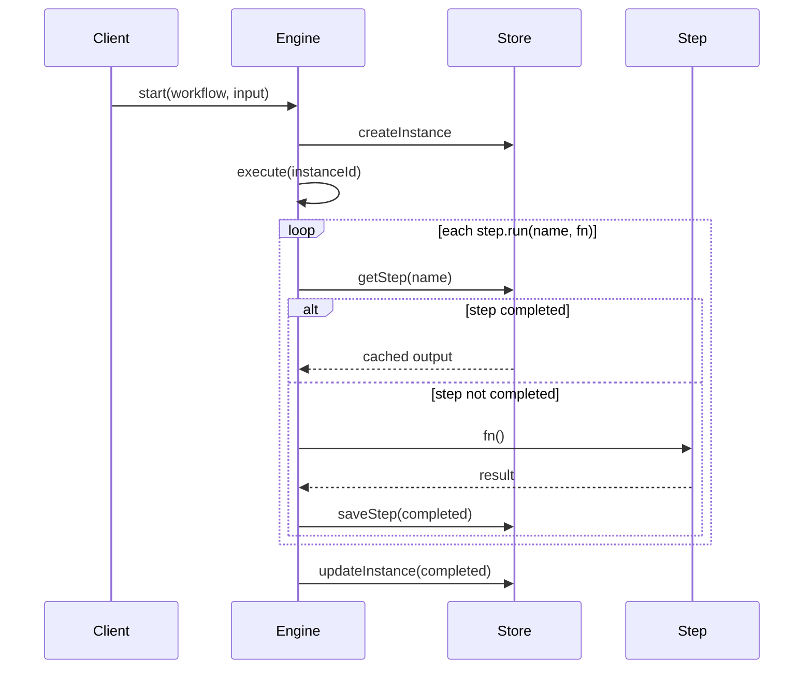

# Architecture

`@kamod-ch/otok-workflows` implements durable execution similar to Temporal or Inngest: each `step.run()` boundary is persisted, and completed steps replay cached output instead of re-invoking side effects.

## Core flow



## Durability guarantee

After a process crash, `execute()` re-enters `workflow.run()` from the top. For each step name:

1. If `store.getStep()` returns `status: "completed"`, the stored `output` is returned — **`fn` is never called**.
2. If the step failed or never ran, `fn` runs (with retry/backoff per policy).
3. Parallel sub-steps use dotted names (`fetch.a`, `fetch.b`) and are individually durable.

This prevents duplicate side effects (API calls, emails, DB writes) for completed work.

## Lifecycle

| Status | Meaning |
|--------|---------|
| `pending` | Created, waiting for `availableAt` (delay) |
| `running` | Actively executing steps |
| `paused` | Manually paused |
| `waiting_approval` | Blocked on `step.waitForApproval()` |
| `completed` | All steps done, output stored |
| `failed` | Step failed, retryable on next `execute()` |
| `cancelled` | Cancelled by user |
| `dead` | Max retries exceeded, dead-letter enqueued |

## Providers

| Provider | Module | Use case |
|----------|--------|----------|
| Memory | `providers/memory` | Dev/tests |
| Kysely | `providers/kysely` | SQLite/Postgres |
| Cloud | `providers/cloud` | Contract for AWS/GCP/CF adapters |

## Triggers

- **Immediate**: `engine.start()` with default `autoExecute: true`
- **Delayed**: `start(..., { delayMs })` — `processRunnable()` picks up when `availableAt` passes
- **Cron**: `engine.registerCron()` + periodic `processRunnable()`
- **Webhook**: plugin route `POST /workflows/webhook/:workflowName`
- **Events**: `engine.triggerByEvent(eventName, payload)` — map events to workflows (extend in app)

## Observability

Pass `observability` hooks to `WorkflowEngine`:

```ts
new WorkflowEngine({
  store,
  observability: {
    onStepStart(instance, stepName) { /* ... */ },
    onStepComplete(instance, stepName, output) { /* ... */ },
    onWorkflowFailed(instance, error) { /* ... */ },
  },
});
```

Use `redactFields` on workflow definitions to strip sensitive input from logs.

## Compensation

When max retries are exhausted, `compensate()` runs with completed steps, then the instance moves to `dead` and is recorded in the dead-letter queue.
